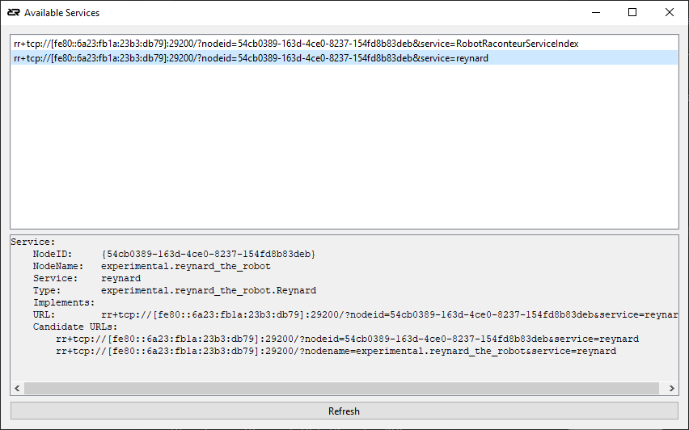

======================
Connecting to Services
======================

.. contents:: Table of Contents
   :depth: 1
   :local:
   :backlinks: none

Introduction
============

Clients form "connections" to services to access the resources provided by the service, as discussed
in :ref:`client-service-model`. The connection consists of three pieces: the transport connection between
the nodes, the client references/proxies, and the service endpoint. These pieces are all created automatically
when the connection is created.

Connections can be created using several different methods. These methods include:

* Connect using a URL
* Create a subscription using a URL
* Create a subscription based on service criteria
* Connect using the Device Connector
* Connect using the PyRI Device Manager
* Use discovery to find available devices

The best method to use will depend on the exact use case. For most simple use cases, such as a laboratory environment,
using a URL or a subscription with a URL is the simplest. For production environments, using the Device Connector
or the PyRI Device Manager is probably more appropriate.

Note that firewalls and networking configurations can cause problems with connections between computers.
See the "Networking and Firewalls" section below for more information.

This page is only an introduction to creating connections. See the more in-depth documentation for more details.

Connect using a URL
===================

The simplest and most direct method to connect to a service is by using a URL and the ``ConnectService()`` function.

.. tabs::

    .. group-tab:: Python

        .. literalinclude:: ../../../examples/features/connecting/python/connect_url.py
            :language: python
            :linenos:

    .. group-tab:: MATLAB

        .. literalinclude:: ../../../examples/features/connecting/matlab/connect_url.m
            :language: matlab
            :linenos:

    .. group-tab:: LabView

        .. image:: https://raw.githubusercontent.com/robotraconteur/robotraconteur/master/examples/features/connecting/labview/connect_url.png
            :align: center

    .. group-tab:: C\#

        .. literalinclude:: ../../../examples/features/connecting/cs/connect_url.cs
            :language: csharp
            :linenos:

    .. group-tab:: C++

        .. literalinclude:: ../../../examples/features/connecting/cpp/connect_url.cpp
            :language: cpp
            :linenos:

Finding the URL for a service can be tricky. There are multiple "transports" to connect to the service,
and the exact contents of the URL are very specific to the network topology between the client and the service.
In the examples above, the ``rr+tcp`` "scheme" at the beginning of the URL means the connection is using TCP/IP,
a networking transport that is common on the Internet and local networks. ``localhost`` means that the service is
on the same computer as the client. This would be replaced with the IP address of the computer running the service
if it was not running on the same machine. For example, ``192.168.11.14`` is an IPv4 address for a computer on
a local network. The ``?service=reynard`` means that we are attempting to connect to a service named ``reynard``
on the node. The ``rr+local`` transport scheme for the "local" transport is also frequently used. This
transport uses local sockets and has higher performance since it is only used for services running on the same computer.

The README, documentation, and examples for services will often contain information about how to find the URL
for the service.

The `Robot Raconteur Service Browser <https://github.com/robotraconteur/RobotRaconteur_ServiceBrowser>`_ can
be used to find service URLs using discovery.

It is advised to always
run the service browser on the same computer as the client. This will return a URL that is valid for that
exact scenario. For example, when searching for Reynard the Robot on a different computer, the following
URL is returned:

.. code-block::

    rr+tcp://[fe80::6a23:fb1a:23b3:db79]:29200/?nodeid=54cb0389-163d-4ce0-8237-154fd8b83deb&service=reynard

Note the IP address in this URL is an IPv6 link-local address rather than IPv4. By default, Robot Raconteur
will use IPv6 addresses since they automatically configure and can be configured to be permanently static
without the headache of IPv4 address assignment. The ``fe80::`` prefix means that this address is only
valid within a local network. Note that this example address is only valid for the example network and
will be different for every setup. The ``nodeid`` and ``nodename`` are optional for TCP in some scenarios,
but one or both are required for other transports like ``rr+local``.

Example ``rr+local`` URLs:

.. code-block::

    rr+local:///?nodeid=e513887c-4512-4ce5-a7e7-1396cfc718f2&service=reynard

.. code-block::

    rr+local:///?nodename=experimental.reynard_the_robot&service=reynard

.. note::

    If discovery does not work, there is probably a firewall configuration error. See the "Firewall" section below.

.. note::

    The following sections on subscriptions and discovery describe how to create connections automatically based on criteria
    for selecting services without the need for a manually configured URL.

The URL has a special form:

.. code-block::

    <scheme>://<host>:<port>/?nodename=<nodename>&nodeid=<nodeid>&service=<servicename>

See the `Framework Nodes and Communication <https://robotraconteur.github.io/robotraconteur/doc/core/latest/cpp/nodes_and_communication.html>`_
documentation for more details on URLs.

Services opened using the ``ConnectService()`` function should be closed using the ``DisconnectService()`` function,
or be closed automatically when the node is shut down.

Subscription using a URL
========================

Robot Raconteur subscriptions are designed to create a robust connection to services and to manage
the lifecycle of connections. They also allow for connectionless-like interaction with `pipe` and `wire` members.
See :ref:`subscriptions` for more information.

Subscriptions can be created using a URL or through criteria. See the rest of this document for information on
criteria-based connections.

Creating a subscription using a URL is similar to connecting to a service using ``ConnectService()``, except
instead of returning a client connection, a ``ServiceSubscription`` is returned.

.. tabs::

    .. group-tab:: Python

        .. literalinclude:: ../../../examples/features/subscriptions/python/subscribe_url.py
            :language: python
            :linenos:

    .. group-tab:: MATLAB

        .. literalinclude:: ../../../examples/features/subscriptions/matlab/subscribe_url.m
            :language: matlab
            :linenos:

    .. group-tab:: LabView

        .. image:: https://raw.githubusercontent.com/robotraconteur/robotraconteur/master/examples/features/subscriptions/labview/subscribe_url.png
            :align: center

    .. group-tab:: C\#

        .. literalinclude:: ../../../examples/features/subscriptions/cs/subscribe_url.cs
            :language: csharp
            :linenos:

    .. group-tab:: C++

        .. literalinclude:: ../../../examples/features/subscriptions/cpp/subscribe_url.cpp
            :language: cpp
            :linenos:

In these examples, the ``SubscribeService()`` and ``GetDefaultClientWait()`` functions are used to create
the connection. The ``GetDefaultClient()`` and ``GetDefaultClientWait()`` functions will return the "default" connected
client. Since ``SubscribeService()`` only connects one client, this is the recommended way to retrieve the connection.

.. note::

    In most cases, it is recommended to use ``SubscribeService()`` and ``GetDefaultClientWait()`` since it will
    not return an error if the client starts before the service is ready.

See :ref:`subscriptions` for more information about the capabilities of ``ServiceSubscription``.

Subscription Based on Service Criteria
======================================

The ``SubscribeServiceByType()`` function returns a ``ServiceSubscription`` that uses discovery to connect
to services rather than using a URL. It decides which services to connect to based on "criteria", essentially
filtering to select services to connect to.

The available criteria are:

* The service type of the root object, for example, ``com.robotraconteur.robotics.robot.Robot``
* The name of the service
* The node name or node ID of the node containing the service
* The type of transport used to connect to the service
* The attributes of the service
* A user-defined predicate function

.. note::

    In most cases, it is preferred to use the Device Connector described in the next section rather than directly
    using ``SubscribeServiceByType()``.

.. note::

    ``SubscribeServiceByType()`` will match services where the root object extends/implements the required type along
    with direct implementations. This allows for new types to extend existing types and still be matched, allowing
    for forward compatibility.

Simple examples connecting all services of a specific type, in this case, ``experimental.reynard_the_robot.Reynard``:

.. tabs::

    .. group-tab:: Python

        .. literalinclude:: ../../../examples/features/subscriptions/python/subscribe_type.py
            :language: python
            :linenos:

    .. group-tab:: MATLAB

        .. literalinclude:: ../../../examples/features/subscriptions/matlab/subscribe_type.m
            :language: matlab
            :linenos:

    .. group-tab:: LabView

        .. image:: https://raw.githubusercontent.com/robotraconteur/robotraconteur/master/examples/features/subscriptions/labview/subscribe_type.png
            :align: center

    .. group-tab:: C\#

        .. literalinclude:: ../../../examples/features/subscriptions/cs/subscribe_type.cs
            :language: csharp
            :linenos:

    .. group-tab:: C++

        .. literalinclude:: ../../../examples/features/subscriptions/cpp/subscribe_type.cpp
            :language: cpp
            :linenos:

The following examples show how to use filters with ``SubscribeServiceByType()``.

.. collapse:: SubscribeServiceByType() Filter Examples (click to expand)

    .. tabs::

        .. group-tab:: Python

            .. literalinclude:: ../../../examples/features/subscriptions/python/subscribe_filter.py
                :language: python
                :linenos:

        .. group-tab:: MATLAB

            .. literalinclude:: ../../../examples/features/subscriptions/matlab/subscribe_filter.m
                :language: matlab
                :linenos:

        .. group-tab:: LabView

            .. image:: https://raw.githubusercontent.com/robotraconteur/robotraconteur/master/examples/features/subscriptions/labview/subscribe_filter.png
                :align: center

        .. group-tab:: C\#

            .. literalinclude:: ../../../examples/features/subscriptions/cs/subscribe_filter.cs
                :language: csharp
                :linenos:

        .. group-tab:: C++

            .. literalinclude:: ../../../examples/features/subscriptions/cpp/subscribe_filter.cpp
                :language: cpp
                :linenos:

|
The ``SubscribeServiceByType`` function and ``ServiceSubscription`` provide sophisticated capabilities.
See :ref:`subscriptions` and the documentation specific to each programming language for more information.

Device Connector
================

The Device Connector is a utility provided as part of the Robot Raconteur Companion for Python and C++. The
Device Connector uses the "Device" concept discussed in :ref:`device-concept` that is introduced
by the Robot Raconteur Standard Types. All "Devices" provide a ``DeviceInfo`` structure that contains
metadata about the device, including a unique identifier (name and UUID), model and manufacturer information,
device class information, serial number, description, tags, and more. The Device Connector uses this metadata
to connect to devices. The Device Connector can also use URLs and subscription filters to connect to services.
This capability is built on top of the Robot Raconteur subscription system.

The Device Connector uses the ``DeviceConnectorDetails`` structure to specify which devices to connect to. The
``DeviceConnectorDetails`` can use the following methods to select devices:

* Device name, along with additional information like tags, manufacturer, model, and serial number. The
  device must provide a ``DeviceInfo`` structure to use this method.
* A list of candidate URLs
* A service type and filter

The following example uses a ``DeviceConnector`` to connect to the camera found in the Training Simulator robot scenes:

.. tabs::

    .. group-tab:: Python

        .. literalinclude:: ../../../examples/features/device_connector/python/device_connector.py
            :language: python
            :linenos:

    .. group-tab:: C++

        .. literalinclude:: ../../../examples/features/device_connector/cpp/device_connector.cpp
            :language: cpp
            :linenos:

The following example uses a YAML file to specify the camera details.

.. literalinclude:: ../../../examples/features/device_connector/python/devices.yml
    :language: yaml
    :linenos:

.. tabs::

    .. group-tab:: Python

        .. literalinclude:: ../../../examples/features/device_connector/python/device_connector_yaml.py
            :language: python
            :linenos:

    .. group-tab:: C++

        .. literalinclude:: ../../../examples/features/device_connector/cpp/device_connector_yaml.cpp
            :language: cpp
            :linenos:

PyRI Device Manager
===================

The `PyRI Open Source Teach Pendant <https://github.com/pyri-project/pyri-core>`_ uses a built-in "Device Manager"
to add and remove devices from the system. The Device Manager can be accessed using a user interface or a Robot Raconteur service.
The Device Manager is typically used with Robot Raconteur services that provide a ``DeviceInfo`` structure.

Third-party nodes can connect to the PyRI Device Manager and use it to connect to devices. In fact,
almost all of the functionality provided by the PyRI Teach Pendant can be used through Robot Raconteur services.
This is a powerful development option since it allows the developer to utilize all the features of PyRI
while developing their projects.

The following example shows how to connect to the PyRI Device Manager and use it to connect to a camera:

.. tabs::

    .. group-tab:: Python

        .. literalinclude:: ../../../examples/features/pyri_device_manager/python/pyri_device_manager_client.py
            :language: python
            :linenos:

Networking and Firewalls
========================

Robot Raconteur uses standard IPv4 and IPv6 networking protocols to communicate between nodes when they
are on different computers, or using ``localhost`` (``127.0.0.1``) when they are on the same computer.
Currently, Robot Raconteur uses TCP/IP for communication; however, UDP/IP communication using
`QUIC <https://en.wikipedia.org/wiki/QUIC>`_ is planned. Networking can be an extremely complex topic
and has many pitfalls that can cause connections to fail. Robot Raconteur is primarily concerned with
local connections between devices on the same local Ethernet network, which reduces the complexity somewhat.
This section provides a brief overview of the relevant networking concepts to create connections. See
also the `Networking and Firewall Configuration Application Note <https://github.com/robotraconteur/robotraconteur/wiki/Networking-and-Firewall-Configuration>`_
for up-to-date information
on networking and firewall configuration, along with tooling to help configure networks correctly.

.. note::

    See the `Networking and Firewall Configuration Application Note <https://github.com/robotraconteur/robotraconteur/wiki/Networking-and-Firewall-Configuration>`_
    for a more in-depth discussion of networking and firewall configuration.

.. note::

    Robot Raconteur has the official TCP and UDP port number 48653 assigned by the `IANA <https://www.iana.org/>`_!
    The Robot Raconteur Port Sharer uses TCP port 48653. Server nodes that are not using the port sharer
    should use a different port number. UDP port 48653 is used for discovery.

Networking Fundamentals
-----------------------

Devices on an IP network have an "IP Address," which allows for packets to be routed to the correct device.

IPv4 addresses are 32-bits and are typically written as four decimal numbers separated by periods, for example,
``192.168.12.14``. IPv4 addresses only have around 4 billion possible addresses, which means that it is not
possible to assign a unique address to every device in existence. Configuration is required
to guarantee a static IPv4 address, which causes significant complications.

IPv6 addresses use a 128-bit address space,
which allows for more than 340 trillion, trillion, trillion possible addresses. IPv6 addresses have the
concept of "link-local" addresses, which are only valid on a single local network. They start with
``fe80::``, and are followed by a 64-bit hexadecimal number, for example, ``fe80::6a23:fb1a:23b3:db79``.
This number can be based on the MAC address
of the adapter or randomly generated. Crucially for Robot Raconteur, this is an automatically configured
address that is statistically guaranteed to be unique on the local network. Robot Raconteur can use both IPv4
and IPv6 addresses, but IPv6 is preferred since it is easier to configure and more robust. The discovery
and subscription system will return IPv6 addresses by default.

.. note::

    By default, Linux uses a randomly generated IPv6 link-local address for privacy reasons. This
    random address may change occasionally, which is highly undesirable for Robot Raconteur services. To disable,
    run the following command in a terminal:

    .. code-block::

        cat >> /etc/sysctl.conf <<EOT
        net.ipv6.conf.all.use_tempaddr=0
        net.ipv6.conf.default.use_tempaddr=0
        EOT

        sysctl -p

    `Source <https://support.binarylane.com.au/support/solutions/articles/1000100519-disable-ipv6-privacy-extension-in-linux>`_

To determine the IP address of a device:

* Use ``ipconfig`` on Windows in a command prompt
* Use ``ip a`` on Linux in a terminal
* Use ``ifconfig`` on MacOS in a terminal

These will typically return many addresses, some with a physical adapter attached to a network, but many
more with virtual adapters that are not relevant. It is recommended that the Service Browser be used
on the same computer as the client to determine the correct address to use since it can be very
difficult to determine the correct address manually unless you are familiar with networking concepts.

Firewall Configuration
----------------------

Most modern operating systems have a firewall that blocks incoming connections by default. This is an important
security feature, but it will by default block Robot Raconteur connections. The firewall must be configured
to allow full access for the program running the Robot Raconteur node. The following subsections discuss
how to configure the firewall for different operating systems.

.. note::

    Robot Raconteur uses IPv6 UDP multicast port 48653 for discovery. This port must be open for discovery,
    or the program must have an exception in the firewall!

Windows Firewall
++++++++++++++++

By default, Windows will block Robot Raconteur. It is necessary to either add an exception or disable
the firewall completely. Disabling the firewall is useful for a development environment, but in general,
it is recommended to add an exception for the program running the Robot Raconteur node.

* Instructions to disable the Windows Firewall: `Windows Firewall <https://support.microsoft.com/en-us/help/4028544/windows-10-turn-windows-defender-firewall-on-or-off>`_
* Instructions to add an exception to the Windows Firewall for a specific program: `How to Allow or Block a Program Through Firewall Windows 10 <https://www.minitool.com/news/how-to-allow-a-program-through-firewall-windows-10.html>`_

When a program first starts and attempts to open a port, Windows will typically prompt the user to allow or block
the connection. This is the easiest way to configure the firewall.

Linux Firewall
++++++++++++++

Ubuntu and Debian do not by default have a firewall enabled. If a firewall is enabled, it is typically
`UFW <https://help.ubuntu.com/community/UFW>`_ or `iptables <https://wiki.debian.org/iptables>`_.
Configuring these firewalls is more complex than Windows, and it is recommended to consult the documentation.

MacOS Firewall
++++++++++++++

MacOS does not typically have a firewall enabled that blocks Robot Raconteur connections.
