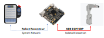
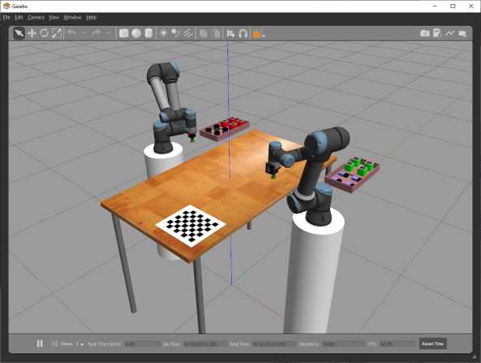
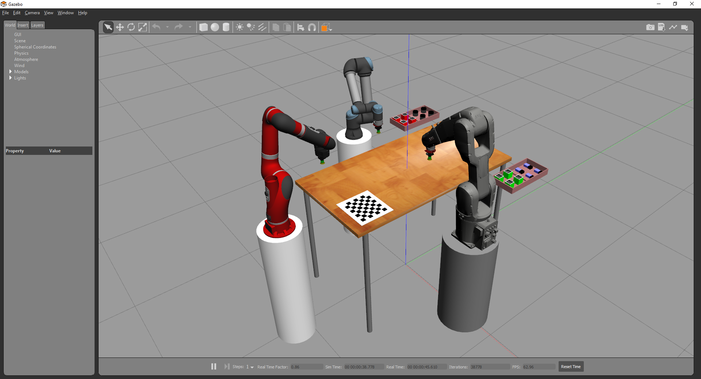
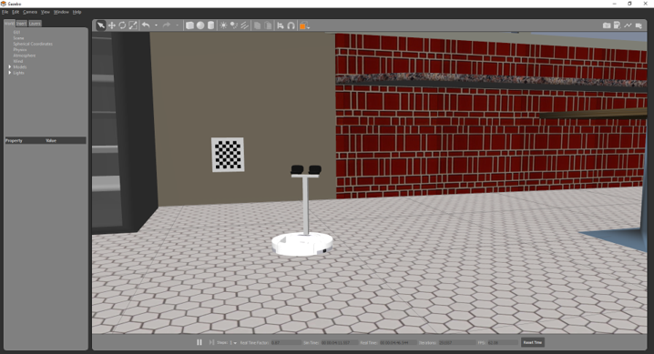

============
Introduction
============

.. contents:: Table of Contents
   :depth: 1
   :local:
   :backlinks: none

Welcome
=======

Robot Raconteur is a powerful communication framework for robotics and automation systems. While intended for
use with robotics, it is flexible enough to be used for other applications, including building control,
infrastructure, and Internet-of-Things applications, among many others. The Robot Raconteur ecosystem consists of
several major segments:

* The `Robot Raconteur Framework Standards <https://github.com/robotraconteur/robotraconteur_standards>`_,
  which define the overall architecture, behavior, protocols, and data formats.
* The official implementations of the Robot Raconteur framework, including
  `Robot Raconteur Core <https://github.com/robotraconteur/robotraconteur>`_,
  `Robot Raconteur Web <https://github.com/robotraconteur/RobotRaconteurWeb>`_,
  and `Robot Raconteur Lite <https://github.com/robotraconteur/robotraconteurlite>`_.

* `Standard Service Definitions <https://github.com/robotraconteur/robotraconteur_standard_robdef>`_ and
  `Companion Libraries <https://github.com/robotraconteur/robotraconteur_companion>`_ that support these standards.

* `Device Drivers, Utilities, User Interfaces, and Support Libraries <https://github.com/robotraconteur/robotraconteur-directory>`_.

  * Many of these components will utilize Standard Types and the Companion Libraries.

* Related projects such as the `PyRI Open-Source Teach Pendant <https://github.com/pyri-project/pyri-core>`_.

The overall Robot Raconteur ecosystem is vast and can be somewhat overwhelming to a new user. This guide will help ease
a new user into understanding and taking full advantage of the ecosystem.

.. note::
   To help locate available components, refer to the
   `Robot Raconteur Directory <https://github.com/robotraconteur/robotraconteur-directory>`_.

.. note::
   This guide is intended to be an introduction and tutorial. See
   `Robot Raconteur Documentation <https://github.com/robotraconteur/robotraconteur/wiki/Documentation>`_ for a full list
   of available reference documentation.

Robot Raconteur has been used on numerous projects and received funding from the United States DoD Advanced
Robotics in Manufacturing (ARM) Institute and New York State.

Presentations
-------------
* Robot Raconteur an Interoperable Middleware: https://www.youtube.com/watch?v=3jhDXIRUiQY
* ROS-Industrial 2022 presentation: https://www.youtube.com/watch?v=nxIUeRPE16k
* ROS Hardware Interfaces Presentation: https://www.youtube.com/watch?v=NqwgbjatKJE

Papers
------

`J. Wason and J. T. Wen, "Robot Raconteur® Updates on an Open Source Interoperable Middleware for Robotics", in Proc. IEEE Conference on Automation Science and Engineering, 2023, pp. 1-8. <https://files2.wasontech.com/RobotRaconteur_CASE2023.pdf>`_

`H. He, B. Aksoy, G. Saunders, J. Wason, and J. T. Wen, "Plug-and-play software architecture for coordinating multiple industrial robots and sensors from multiple vendors", in Proc. IEEE Conference on Automation Science and Engineering, 2023, pp. 1-8. <https://files2.wasontech.com/RobotRaconteur_CASE2023_plugandplay.pdf>`_

`J. Wason, "Robot Raconteur® version 0.8: An Updated Communication System for Robotics, Automation, Building Control, and the Internet of Things", in Proc. IEEE Conference on Automation Science and Engineering, 2016, pp. 595-602. <https://files2.wasontech.com/RobotRaconteur_CASE2016.pdf>`_

`J. Wason and J. T. Wen, "Robot Raconteur: A Communication Architecture and Library for Robotic and Automation Systems", in Proc. IEEE Conference on Automation Science and Engineering, 2011, pp. 761-766. <https://files2.wasontech.com/RobotRaconteur_CASE2011.pdf>`_

Examples
--------

* Microassembly: https://www.youtube.com/watch?v=2KrOI6GOogE
* Human Guided Dual-Arm Manipulation: https://www.youtube.com/watch?v=OfFp_3kPHCk
* Cooperative Robotics: https://www.youtube.com/watch?v=FQqaPFqu0Gk
* Smart Conference Room: https://sites.ecse.rpi.edu/~rjradke/papers/afshari-buildsys15.pdf
* Assistive Robotics: https://www.youtube.com/watch?v=5JM8bgZvMg0
* PyRI Open-Source Teach Pendant: https://www.youtube.com/watch?v=9KSYgGpG8mk

Features
========

The Robot Raconteur framework is an advanced form of "Remote Procedure Call" (RPC) middleware specially designed
for robotics and automation systems. This specialization is designed to improve interactions with robots in terms of
organization and semantics of interacting with devices, discovery/connection management, data types, data communication
latency, and reliability. Robot Raconteur is an "augmented-object oriented" RPC system. The "augmented" means
that the objects have extra "member types" which support communication semantics required for robotics applications.
This unique design allows for true plug-and-play operation of Robot Raconteur, and significantly greater ease-of-use
compared to competing frameworks.

.. note::
    Robot Raconteur has a unique "augmented object-oriented" design and is very different from
    ROS Middleware, which is a pub-sub system. Robot Raconteur can provide similar functionality to pub-sub
    systems using "Subscriptions", but the focus is on the client-service model.

Robot Raconteur currently supports the following platforms:

* Windows (>WinXP)
* Linux
* MacOS (>10)
* Android
* iOS
* FreeBSD
* WebAssembly (Robot Raconteur Core with Emscripten)
* Web Browser (Robot Raconteur Web)
* ASP.NET Server (Robot Raconteur Web)
* Arduino (specialized demo)

Support is planned for VxWorks and QNX.

The following computer languages are supported:

* C++
* Python
* MATLAB
* C#
* Java
* LabView
* ANSI C (under development)
* JavaScript (under development)

Support is planned for `Rust <https://github.com/robotraconteur/robotraconteur/issues/86>`_,
`Go <https://github.com/robotraconteur/robotraconteur/issues/87>`_, and
`Lua <https://github.com/robotraconteur/robotraconteur/issues/88>`_.

.. Note::
   Most applications will use the Robot Raconteur Core implementation. Supported languages for the core library are
   C++, Python, MATLAB, C#, Java, and LabView. The LabView implementation is a commercial add-on available from
   Wason Technology, LLC. See the
   `Installation <https://github.com/robotraconteur/robotraconteur/blob/master/docs/common/installation.md>`_ page for
   instructions of how to obtain the LabView add-on.

Robot Raconteur has these additional differentiating features:

* Compatibility: 22 platforms/architectures, 7 languages, 6 transport technologies
* Client-service model
* “Augmented Object-Oriented” model
* Forward and backwards compatibility using polymorphism
* Plug and play capability
* Request-Response, streaming, and “most recent”
* TLS, certificates, and password security

  * Two central certificate authority chains, by Digicert and private HSM
  * Certificates available at nominal cost

* Compatible with Web and Cloud using WebSockets
* Node and service discovery
* Long-Term compatibility
* Open Source, Apache 2.0 License, first open source release Fall 2018
* Open Standards: https://github.com/robotraconteur/robotraconteur_standards
* Core library package “robotraconteur” available in ROS Noetic and ROS Humble
* Robot Raconteur ↔ ROS 2 Bridge: https://github.com/robotraconteur-contrib/robotraconteur_ros2_bridge

.. _client-service-model:

Client-Service Object-Oriented Model
====================================

Robot Raconteur uses an object-oriented client-service model. "Nodes" communicate with each other by passing
"messages" using "transports". All communication between nodes is "packed" into messages, and an
"augmented object-oriented" protocol is built on top of this message passing layer.

The figure below shows the basic architecture of a Robot Raconteur client and service. Services contain some resource
that clients need to access. This resource may be something physical like a robot, or something virtual like a software
application. The service consists of one or more "objects". The objective of Robot Raconteur is to reflect these objects
to the client, creating "object references", sometimes referred to as "proxies". Robot Raconteur is designed to make it
appear to the user as if the object exists locally in the client as much as possible. Essentially, Robot Raconteur
encapsulates the complex communication from the client user, so the user, for the most part, does not need to be concerned
with the details of the communication.

.. image:: ../../python/source/tutorial/figures/client-service.svg
   :alt: Configuration of Client-Service communication
   :name: ClientServiceConfiguration
   :width: 400

Clients "connect" to the service using a known URL or use "discovery" to find the service on the network. Once
connected, the user can communicate with the service using the object "members". In a typical object-oriented
language, these members would include "properties", "functions", and "events". Robot Raconteur uses eight member
types to better handle the types of communication required for robotics:

* ``property``
* ``function``
* ``event``
* ``objref``
* ``pipe``
* ``callback``
* ``wire``
* ``memory``

The use of these members will be discussed throughout the examples.

Request/response members support transparent try/catch exception handling, meaning that exceptions are transported
automatically to the caller. This reduces the amount of boilerplate error-handling code required.

With Robot Raconteur, objects are always passed by "reference," while data is passed by "value." This means that
the service always owns the objects, while data is copied and passed between nodes. The following data types are
supported:

* Numeric primitives including integers, floating points, and complex numbers
* Arrays and multi-dim arrays
* Strings
* Structures
* Pods
* Named arrays
* Containers (map, list)

See the `Framework` documentation for more information.

Plug-and-Play Interoperability
==============================

Robot Raconteur supports plug-and-play operation using two methods:

* Dynamic type and proxy handling

  * Clients connecting to a service receive a “Service Definition” and can dynamically handle objects and value types.
  * Used for scripting languages like MATLAB and Python.

* Interoperability through common or standardized “Service Definitions”

  * Clients are designed to connect to specific defined types. If the service implements the expected types, the client can interact with the service.
  * Standardized types are available for many common devices and systems.

* Deployed systems will require standardized types for interoperability.

  * Dynamic typing for scripting is intended for laboratory and prototyping use.

Discovery and Subscriptions
===========================

Robot Raconteur uses "discovery" to find nodes. Nodes can be running on the same computer, within the same process
(intraprocess), connected over a network, or connected using a peripheral connection such as USB. Discovery uses
transport-specific communication protocols to detect and enumerate available services. For a normal Ethernet local
area network, IPv6 multicast packets are used to detect nodes.

.. note::
    IPv6 uses automatic 128-bit "link-local" addresses that do not require configuration. Robot Raconteur by default
    uses IPv6 addresses.

Discovery can be used to detect nodes and then create connections, or it can be combined with automatic connection
management using "Subscriptions". Subscriptions build on discovery and create robust connections to services based
on connection criteria or based on a URL.

Standard Service Types
======================

Standard service types are used to allow for interoperability between services. For example, robots will often
implement the standard ``com.robotraconteur.robotics.robot.Robot`` object type, defined in the
``com.robotraconteur.robotics.robot`` service definition. Clients that are designed to understand the ``Robot``
standard type will be able to interact with any service that implements this type.

.. note::
    A separate repository is used to store the
    `Standard Service Types <https://github.com/robotraconteur/robotraconteur_standard_robdef>`_,
    often referred to as "standard robdef".
    The companion libraries `Robot Raconteur Companion <https://github.com/robotraconteur/robotraconteur_companion>`_,
    `Robot Raconteur Companion Python <https://github.com/robotraconteur/robotraconteur_companion_python>`_, and
    `Robot Raconteur Companion .NET <https://github.com/robotraconteur/RobotRaconteurNET.Companion>`_
    provide support code. They also contain the "thunk" code so no generation is needed.

Standard Drivers
================

Drivers for various devices such as robots and sensors are constantly under development. Most of these drivers
take advantage of standard types to allow for interoperability. See the
`Directory <https://github.com/robotraconteur/robotraconteur-directory>`_ for a full list of available drivers.

Industrial robots use a base class called "Abstract Robot" to implement drivers. This base class makes implementing
robot drivers relatively easy. The diagram below shows the Robot Raconteur driver running on an embedded computer,
connecting to the robot using a private network. The driver communicates with the robot using proprietary protocols
and provides a standard interface to the system network.

Reynard the Robot
=================

Reynard the Robot is a simple cartoon robot used to demonstrate the capabilities of Robot Raconteur. See
the `Meet Reynard the Robot <MeetReynardTheRobot>`_ page for more information.

Training Simulator
==================

A `Training Simulator <https://github.com/robotraconteur-contrib/robotraconteur_training_sim>`_ based on the Gazebo
robot simulator has been developed to help learn Robot Raconteur and test
new ideas in a safe environment. The simulator runs on Windows, Linux, and MacOS.

Three scenes are included in the simulator:

* Universal Robot UR5e Scene

  * Two Universal Robots UR5e Robots
  * Two simulated vacuum grippers
  * An overhead simulated camera
  * Payloads
  * Calibration target

* Multi Robot Scene

  * Universal Robots UR5e Robot
  * ABB IRB 1200-5/0.9 Robot
  * Rethink Robotics Sawyer Robot
  * Three simulated vacuum grippers
  * An overhead simulated camera
  * Payloads
  * Calibration target

* iRobot Create 1 Scene

  * iRobot Create
  * Stereo camera mounted on robot
  * "Cafe" scene from the Gazebo model library

The simulator uses the
`Robot Raconteur Gazebo Plugin <https://github.com/robotraconteur-contrib/RobotRaconteur_Gazebo_Server_Plugin>`_, which
allows for most of the API of Gazebo to be accessed using
Robot Raconteur. Simulated device drivers interact with the plugin to simulate device behavior.

Examples
========

The rest of this Getting Started manual contains examples of using Robot Raconteur. This guide covers Python,
MATLAB, and LabView examples. Select the appropriate tab for the language you are using by clicking on the tab
name.
Refer to the documentation for
each specific library and computer language for detailed reference beyond what is offered in the examples, including
the other supported computer languages.

.. note::
    Leave a message on the `Discussion <https://github.com/robotraconteur/robotraconteur/discussions>`_
    board if you have a question!
