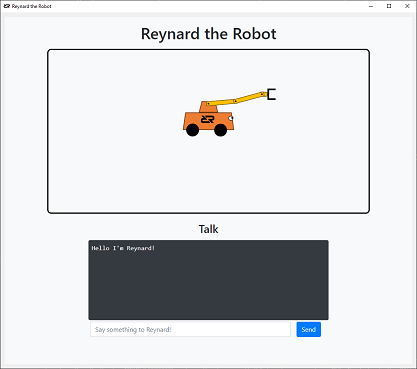

======================
Meet Reynard the Robot
======================

.. contents:: Table of Contents
   :depth: 1
   :local:
   :backlinks: none

Introduction
============

Reynard the Robot is a simple cartoon robot designed to help users learn the Robot Raconteur communication framework,
and also learn how to develop interfaces for various devices and software components. Reynard is implemented
as a simple Python package that uses a web browser to display the robot and its user interface. The base of the
robot can be translated in the X and Y directions, and robot arm has three revolute joints, for a total
of 5 degrees of freedom. The user interface also provides a simple chat window to send and receive messages.

Installation
============

Reynard the Robot is a simple Python package that can be installed using pip.
To install Reynard the Robot, use the following command:

.. code-block:: bash

    python -m pip install reynard_the_robot

On Linux, it may be necessary to use ``python3`` instead of ``python``. Use ``python3`` in all future
commands if this is the case. It may also be necessary to install the ``python3-pip`` package on Linux. On Ubuntu and
Debian, run ``sudo apt-get install python3-pip`` to install pip for Python 3.

Start Reynard the Robot Server
==============================

Most of the examples in the Robot Raconteur documentation use Reynard the Robot as an example. To start Reynard the
Robot as a Robot Raconteur service, use the following command:

.. code-block:: bash

    python -m reynard_the_robot

Remember to use ``python3`` instead of ``python`` on Linux if necessary.

With the server running, open a web browser to the address `http://localhost:29201 <http://localhost:29201>`_ to
see Reynard the Robot!

The Robot Raconteur server is now and can be connected to using the Robot Raconteur client libraries. The following
is an example of a Python client that connects to the Reynard the Robot server:

.. code-block:: python

    from RobotRaconteur.Client import *

    c = RRN.ConnectService('rr+tcp://localhost:29200?service=reynard')
    c.say("Hello from Robot Raconteur client!")

Reynard the Robot as a Python Package
=====================================

Run the following script to run Reynard the Robot directly from Python as a Python class:

.. code-block:: python

    from reynard_the_robot import Reynard

    reynard = Reynard()
    reynard.start()
    reynard.say("Hello, I am Reynard the Robot!")
    reynard.teleport(100,200)

    input("Press enter to exit")

Run the script using Python, and open a web browser to the address `http://localhost:29201 <http://localhost:29201>`_
to see Reynard the Robot.

Remember to use ``python3`` instead of ``python`` on Linux if necessary.

Reynard the Robot Control Interfaces
====================================

Robots, industrial devices, and software components have a myriad of possible software interfaces. These interfaces
can be simple digital/analog signals, serial communication, network communication, proprietary protocols, software
application programming interfaces (APIs), and more.
These various software interfaces can be bewildering to
programmers and system integrators who are trying to make these devices work together. Reynard the Robot is designed
to be representative of the types of interfaces that are commonly found in real-world devices and software components.
Reynard the Robot implements several of these interfaces to help users learn how to develop interfaces for various
devices and software components.

The following interfaces are provides:

- Python Library API
- Robot Raconteur Service
- HTTP REST API
- Raw ASCII Socket
- ROS 1 (external package required)
- ROS 2 (external package required)

See the `Reynard the Robot Documentation <https://reynard-the-robot.readthedocs.io/>`_ for details on how to use these
various interfaces.

The Robot Raconteur documentation uses Reynard the Robot as an example to demonstrate how to use the Robot Raconteur
communication framework. The documentation will also show how to use the various interfaces
to develop Robot Raconteur drivers.
